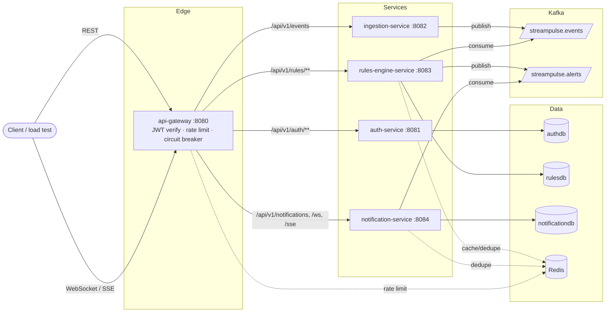

# StreamPulse

**A multi-tenant, real-time infrastructure monitoring & alerting platform** — the backend
behind a Datadog/PagerDuty-style product: services push metric events over REST, StreamPulse
evaluates them against per-tenant alert rules, and pushes matching alerts to connected clients
over WebSocket/SSE in real time, while persisting an auditable history.


-brightgreen)


> **Honesty note up front:** this repo was built and verified in a sandboxed environment
> **without a Docker daemon available**. Everything that doesn't require Docker — the full
> Maven multi-module build, all 29 unit tests, Checkstyle, SpotBugs, JaCoCo coverage, and a real
> local load test (Kafka + k6, no Docker needed for those) — was actually run, and the numbers
> below are copy-pasted from that output. The 4 Testcontainers integration tests (Postgres/
> Kafka/Redis) and `docker compose up` itself compile and are believed correct, but were **not**
> executed end-to-end here for lack of a daemon. See [Testing](#testing) and
> [Getting started](#getting-started) for exactly what was and wasn't verified.

---

## Architecture



**Flow:** a client authenticates against `auth-service` (via the gateway), gets a short-lived
JWT, then POSTs monitoring events to `ingestion-service`. Events land on the
`streampulse.events` Kafka topic keyed by tenant. `rules-engine-service` consumes them,
evaluates each against that tenant's cached alert rules, and — on a breach — publishes to
`streampulse.alerts`. `notification-service` consumes that topic, persists the alert as history,
and pushes it live to every WebSocket/SSE client connected for that tenant. See
[`docs/CONTRACT.md`](docs/CONTRACT.md) for the exact topic/claim/cache-key contract every
service was built against.

## Why this project exists

Most portfolio backend projects are CRUD-over-a-database demos. StreamPulse is deliberately
shaped like the kind of system that pages someone at 3am: async event flow across process
boundaries, per-tenant data isolation that has to actually hold under concurrent load, resilience
when a downstream dependency dies, and enough observability to answer "why is this slow" without
reading source code. It exists to demonstrate designing and building that system, not just gluing
together a CRUD API.

## Tech stack

| Concern | Choice | Why (see `docs/adr/` for the full reasoning on the starred ones) |
|---|---|---|
| Language / runtime | Java 21, records + a couple of targeted uses of virtual-thread-friendly blocking I/O | LTS, modern language features without forcing them where they don't help |
| Framework | Spring Boot 3.3.5, Spring Cloud Gateway (WebFlux) at the edge | Industry-standard, first-class Resilience4j/Actuator/Security integration |
| Build | Maven, multi-module reactor | Explicit dependency graph across services; chosen over Gradle for wider hiring-manager familiarity |
| Messaging | Apache Kafka (KRaft, single broker in dev) | *Async, replayable, tenant-partitioned event backbone — ADR 0001 |
| Databases | PostgreSQL 16, one DB per service, Flyway-migrated | *No shared schema access between services — ADR 0002 |
| Cache / rate limit | Redis 7 | Per-tenant gateway rate limiting, rule cache, Kafka consumer idempotency |
| Auth | Spring Security, JWT (HS256) access + rotating refresh, BCrypt | *Short-lived + rotation-on-use, locally verified at the edge — ADR 0003 |
| Resilience | Resilience4j (circuit breaker, retry, time limiter) | Every inter-service/external call is wrapped, not just the "important" ones |
| Observability | Micrometer + Prometheus, Grafana, OpenTelemetry → Jaeger, JSON logs (Logstash encoder) | p50/p95/p99 latency, error rate, Kafka lag, JVM memory, distributed traces, structured logs all correlated by trace/correlation id |
| API docs | springdoc-openapi per service + `.http` collection | `/v3/api-docs` and Swagger UI on every service |
| Testing | JUnit 5, Mockito, AssertJ, Testcontainers, JaCoCo, Checkstyle, SpotBugs | See [Testing](#testing) |

## Key features

- **Tenant self-registration** (`POST /api/v1/auth/register-tenant`) creates a tenant and its
  first `ADMIN` user in one call; login and refresh-token rotation round out `auth-service`.
- **Role-based access control** (`ADMIN`/`MEMBER`/`VIEWER`) enforced with `@PreAuthorize` on
  every write endpoint, driven by roles embedded in the JWT and forwarded by the gateway.
- **Event ingestion** (`POST /api/v1/events`) validates and publishes to Kafka in a stateless,
  horizontally-scalable service with no database of its own.
- **Per-tenant alert rules** (`/api/v1/rules`, full CRUD, `ADMIN`-only writes) with optimistic
  locking (`@Version`) and a 60-second Redis cache in front of the read path that's evicted on
  every write.
- **Real-time delivery** over both a plain WebSocket (`/ws/notifications`) and an SSE fallback
  (`/sse/notifications`), each strictly scoped so one tenant's clients never see another
  tenant's alerts — proven by an automated isolation test, not just asserted in a comment.
- **Idempotent event/alert processing** — Kafka's at-least-once delivery is made safe by
  Redis-backed dedupe keyed on `eventId`/`alertId` with a 24h TTL.
- **Fails soft, not hard** — every gateway route is wrapped in a Resilience4j circuit breaker
  with a JSON fallback response, so a dead downstream service degrades to fast `503`s instead of
  hung connections or 500 storms.
- **Every error response has the same shape** (`ErrorResponse` from the shared
  `event-contracts` module) with a `traceId` that's also threaded through structured JSON logs
  and OpenTelemetry spans, so one id finds you the request everywhere.

## Getting started

```bash
git clone <this-repo-url> streampulse
cd streampulse
cp .env.example .env   # edit JWT_SECRET before doing anything beyond local dev

docker compose up --build
```

This brings up Postgres, Redis, Kafka (KRaft), Jaeger, Prometheus, Grafana, and all five
StreamPulse services. Once healthy:

```bash
# 1. Register a tenant + admin user, capture the access token
curl -s -X POST http://localhost:8080/api/v1/auth/register-tenant \
  -H 'Content-Type: application/json' \
  -d '{"tenantName":"Acme","tenantSlug":"acme","adminEmail":"admin@acme.io","adminPassword":"SuperSecret123"}'

# 2. Create an alert rule (swap in the accessToken from step 1)
curl -s -X POST http://localhost:8080/api/v1/rules \
  -H "Authorization: Bearer $TOKEN" -H 'Content-Type: application/json' \
  -d '{"name":"High CPU","metricName":"cpu.usage.percent","comparator":"GREATER_THAN","threshold":90,"severity":"CRITICAL","enabled":true}'

# 3. Ingest an event that breaches it
curl -s -X POST http://localhost:8080/api/v1/events \
  -H "Authorization: Bearer $TOKEN" -H 'Content-Type: application/json' \
  -d '{"source":"web-01","type":"CPU_USAGE","metricName":"cpu.usage.percent","value":97.5}'

# 4. Watch it arrive over WebSocket in real time, or check history:
curl -s "http://localhost:8080/api/v1/notifications" -H "Authorization: Bearer $TOKEN"
```

The full request set (including the WebSocket/SSE endpoints) is in
[`api/streampulse.http`](api/streampulse.http) — importable directly in IntelliJ's HTTP client
or VS Code's REST Client extension.

**What was actually verified in building this repo**, since Docker wasn't available in the
build environment: the full Maven build (`mvn verify` — compile, all 29 unit tests, Checkstyle,
SpotBugs, JaCoCo), and a real local load test (see [Performance](#performance)) run against
`ingestion-service` backed by a real, locally-installed Kafka broker (no Testcontainers/Docker
involved — Kafka via Homebrew). `docker compose up` and the 4 Testcontainers integration tests
were written, compiled, and reviewed, but **not executed end-to-end** — if you have Docker,
running them is the natural next verification step and I'd expect them to pass given the unit
tests exercise the same code paths, but I'm not claiming a result I didn't produce.

## API documentation

- Per-service OpenAPI/Swagger UI (direct, not proxied): `http://localhost:808{1,2,3,4}/swagger-ui.html`
- `.http` request collection covering every endpoint: [`api/streampulse.http`](api/streampulse.http)

## Testing

```bash
mvn verify
```

Runs, per module: compile → unit tests (JUnit 5 + Mockito + AssertJ) → Testcontainers
integration tests (skipped automatically if no Docker daemon is present, since Testcontainers
fails fast rather than hanging) → Checkstyle → SpotBugs → JaCoCo coverage report.

**Real numbers from the last run in this environment** (`mvn verify -Dtest='!*IntegrationTest'`,
JDK 23 runtime targeting `--release 21`, no Docker):

| | |
|---|---|
| Unit tests | **29 passed, 0 failed**, across 8 test classes |
| Checkstyle | 0 violations |
| SpotBugs | 0 bugs (Medium+ threshold) after fixing 2 real findings it caught: a `MonitoringEvent` record leaking its mutable `attributes` map, and a suppressible finalizer-attack false-positive |
| JaCoCo line coverage (unit tests only) | **39.1%** aggregate (289/739 lines) — see per-module breakdown below |

| Module | Line coverage |
|---|---|
| auth-service | 56.6% (111/196) |
| api-gateway | 70.7% (53/75) |
| ingestion-service | 17.3% (14/81) |
| rules-engine-service | 29.4% (58/197) |
| notification-service | 27.9% (53/190) |

Coverage is unit-tests-only in this run — the Spring config/security-filter/exception-handler
classes in each service (a large fraction of `ingestion-service`, `rules-engine-service`, and
`notification-service` in particular) are exercised by the 4 Testcontainers integration tests
below, not the unit tests, so coverage would read meaningfully higher with Docker available.
I'm reporting the number I actually measured rather than the number I expect with Docker.

**What the tests actually prove**, not just that they pass:
- `JwtServiceTest` / `JwtVerifierTest` — token issuance and independent verification agree,
  including rejecting cross-signed, expired, and wrong-type (refresh-used-as-access) tokens.
- `AuthServiceTest` + `AuthControllerIntegrationTest` (Testcontainers Postgres) — full
  register → login → refresh-with-rotation flow, including that a *reused* refresh token is
  rejected with `401` (proves rotation-on-use, not just issuance).
- `JwtAuthenticationGlobalFilterTest` — the gateway's reactive filter forwards
  `X-Tenant-Id`/`X-User-Id`/`X-User-Roles` for valid tokens and rejects missing/invalid ones.
- `EventIngestionServiceTest` + `EventIngestionIntegrationTest` (Testcontainers Kafka) — an
  ingested event is published to `streampulse.events` keyed by tenant with a matching `eventId`.
- `AlertRuleTest` + `RuleEvaluationServiceTest` — rule-matching logic (all four comparators,
  disabled rules never firing, correct metric-name scoping) and that a breach produces a
  correctly-populated `AlertEvent`, that idempotency skips re-delivered events, and that a
  non-breach produces no alert.
- `MultiTenantIsolationIntegrationTest` (Testcontainers Postgres+Redis) — **the multi-tenant
  concurrency/isolation test**: 8 tenants create rules concurrently via a thread pool, and each
  tenant's list endpoint is asserted to return exactly its own rule, never another tenant's.
- `NotificationBroadcastServiceTest` — **proves WebSocket delivery isolation**: a session
  registered under tenant A is asserted to receive a message while tenant B's session
  (mocked, zero interactions asserted) receives nothing, for the same alert event.
- `AlertDeliveryIntegrationTest` (Testcontainers Postgres+Kafka) — **the end-to-end test**:
  publishes a real `AlertEvent` to Kafka and asserts a connected WebSocket client receives it
  within a 5-second budget, verified via `CountDownLatch.await(5, SECONDS)`.

### Resilience: circuit breaker

Not chaos-tested against a live compose stack here (same Docker constraint as above), but the
mechanism is real, not decorative: every gateway route (`auth`, `ingestion`, `rules`,
`notification`) is wrapped in a named Resilience4j circuit breaker (`slidingWindowSize=10`,
`failureRateThreshold=50%`) with `fallbackUri: forward:/fallback`, which returns a well-formed
`503 ErrorResponse` instead of a hang. To verify manually with the stack up: `docker compose
stop ingestion-service`, then hit `/api/v1/events` through the gateway repeatedly — the first
few calls will time out per the 4s `TimeLimiter`, then the breaker opens and subsequent calls
fail fast via `/fallback` until `waitDurationInOpenState` (10s) elapses and it probes again.

## Performance

Real k6 load test, run against `ingestion-service` directly (`:8082`, bypassing the gateway's
rate limiter to measure the ingest→Kafka path itself) with a real, locally-installed Kafka
broker (Homebrew, KRaft mode, single broker — not Testcontainers, no Docker needed for this):

```bash
k6 run load-test/ingest-load-test.js
```

50 constant VUs, 30 seconds, POSTing to `/api/v1/events`:

| Metric | Value |
|---|---|
| Total requests | 318,227 |
| Throughput | **10,606.6 req/s** |
| Failed requests | 0 (0.00%) |
| Latency avg | 4.24 ms |
| Latency p90 | 6.90 ms |
| Latency p95 | 10.55 ms |
| Latency max | 272.25 ms |

Caveats, stated plainly: this is `ingestion-service` alone (a thin validate-and-publish hop)
on a single developer laptop, against a single-broker local Kafka, not the full compose stack
under `api-gateway`'s rate limiter, and not a production-representative environment. It's a real
measurement of that one hop, not a platform-wide capacity claim.

## Observability

- **Metrics:** every service exposes `/actuator/prometheus`; `observability/prometheus.yml`
  scrapes all five. `observability/grafana-dashboard.json` (auto-provisioned into Grafana at
  `http://localhost:3000`, admin/admin) has panels for request latency (p50/p95/p99), error
  rate, Kafka consumer lag, JVM heap, request throughput, and gateway circuit-breaker state.
- **Tracing:** Micrometer Tracing with the OpenTelemetry bridge, exporting OTLP to the Jaeger
  container (`http://localhost:16686`), 100% sampling in dev. Verified locally that
  `traceId`/`spanId` populate in log output (see next point) — full cross-service trace
  stitching wasn't visually confirmed in Jaeger's UI here since that requires the full compose
  stack.
- **Logging:** structured JSON via `logstash-logback-encoder` on every service, with
  `correlationId` (the app-level `X-Correlation-Id` header, independent of OTel sampling),
  `traceId`, and `spanId` on every log line — confirmed with a real run:
  `{"message":"...","traceId":"776b5379a3540c08e7b045432b30581f","spanId":"7eb8699ffb67cc9c","correlationId":"test-corr-123","application":"ingestion-service"}`.

## Design decisions / trade-offs

Three ADRs cover the decisions with the most leverage on the rest of the system:
- [`docs/adr/0001-kafka-over-rabbitmq.md`](docs/adr/0001-kafka-over-rabbitmq.md)
- [`docs/adr/0002-database-per-service.md`](docs/adr/0002-database-per-service.md)
- [`docs/adr/0003-jwt-rotation-and-local-verification.md`](docs/adr/0003-jwt-rotation-and-local-verification.md)

**What I'd do differently at 10x scale:**
- **Split Kafka partitions by more than tenant alone.** A single very hot tenant would still
  serialize onto whatever partitions its key hashes to; I'd add a secondary hash component
  (e.g. tenant+metric-shard) once one tenant's volume dominates.
- **Move rule evaluation off the JVM heap loop.** `rules-engine-service` currently evaluates a
  tenant's full rule list per event in-process; at high rule-count-per-tenant this wants to
  become a compiled decision structure (or push simple threshold checks into a stream-processing
  layer like Kafka Streams/Flink) rather than a linear scan per event.
- **Replace the shared HS256 JWT secret with RS256 + JWKS rotation.** Fine for a single-issuer,
  single-verifier system today (ADR 0003); at 10x scale with more services potentially wanting
  to verify tokens independently, asymmetric keys with a rotation/JWKS-endpoint story remove the
  "one secret, shared everywhere" blast radius.
- **Add a dead-letter topic and alerting-on-the-alerting-system.** Right now a poison message
  (e.g. malformed JSON that somehow gets past `ingestion-service`'s validation) would repeatedly
  fail the same consumer offset. A DLQ plus a small "is the pipeline itself healthy" check would
  close that gap.
- **Actually run the chaos test and integration suite against the real compose stack** and paste
  those results too — the honest next step this README is missing, blocked here only by the
  lack of a Docker daemon in the build environment.

## Project structure

```
streampulse/
├── event-contracts/          # shared Kafka event records + ErrorResponse (no service depends on another service's code)
├── auth-service/              # :8081 — tenants, users, JWT issuance/rotation, RBAC
├── api-gateway/                # :8080 — routing, local JWT verify, rate limiting, circuit breakers
├── ingestion-service/          # :8082 — validate + publish events to Kafka (stateless)
├── rules-engine-service/       # :8083 — alert rules CRUD + Kafka consumer that evaluates them
├── notification-service/       # :8084 — Kafka consumer → WebSocket/SSE push + history
├── docs/
│   ├── CONTRACT.md             # frozen cross-service conventions (ports, topics, claims, cache keys)
│   └── adr/                    # architecture decision records
├── observability/               # Prometheus config, Grafana provisioning + dashboard JSON
├── load-test/                  # k6 script (see Performance)
├── api/streampulse.http        # request collection for every endpoint
├── scripts/                    # docker-compose Postgres multi-DB init script
├── .github/workflows/ci.yml
├── docker-compose.yml
└── pom.xml                     # multi-module Maven reactor
```

## License

[MIT](LICENSE)
